# BPA-SAR-simulation
## 概述

使用后向投影算法(BPA)完成成像仿真

SAR在网络上算是一个冷门方向，所以相关代码和原理解读其实是不多的。这个问题让SAR方向的初学者在最开始接触SAR阶段很迷惑，所以能上传一份代码，讲一讲原理就是我很开心的事情了。
希望大家可以一起学习，一起进步。

所谓后向投影算法，其实是考虑到雷达发出LFM波后，会有回波返回，考虑到时延以完成距离维度成像点的区分。在此基础上使用插值方法，完成方位维的脉冲压缩。

现在我们开始用图片结合公式来更好地描述一下什么是BPA算法。

## 原理

### LFM波

首先，我们发射线性调频(LFM)波，其表达式可以如下所示：

上述公式中，代表快时间数据，代表慢时间数据。为矩形窗函数，代表快时间信号在一个时刻内有效。代表载波频率，代表距离维调频率。

LFM信号时域部分如下图所示：

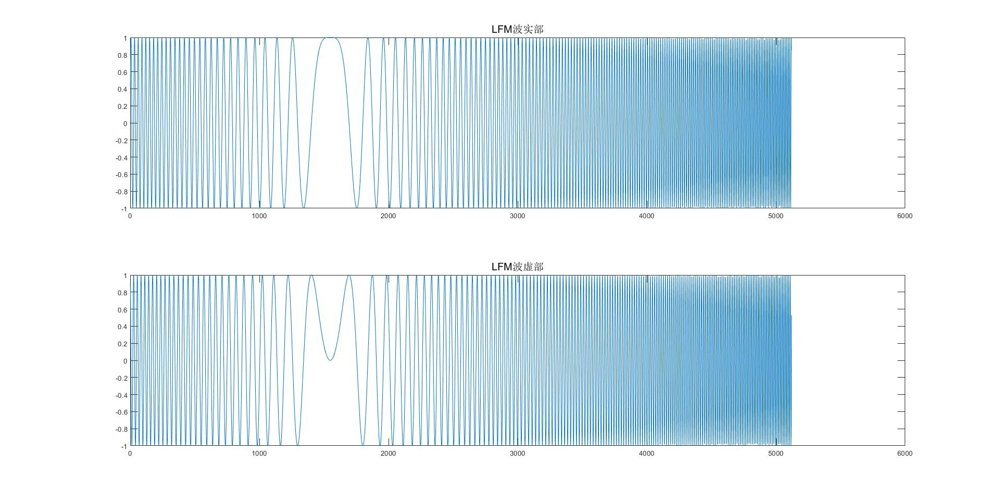

LFM信号频域部分如下图所示：

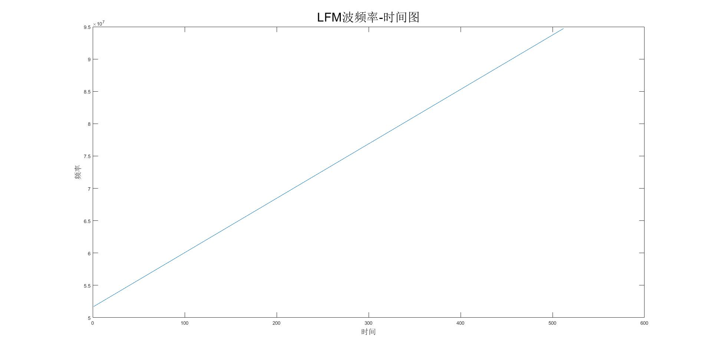

得到回波信号则对应为：
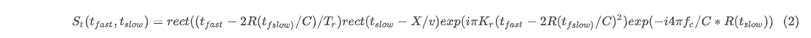
就此，我们可以得到回波信号。

### 距离维脉压

距离维脉压其实有两种方法（我也只用过这两种-_-!）:

一种是使用匹配滤波器，一种是使用FMCW方式。

匹配滤波器：

由于时域匹配滤波器需要使用参考信号时间反褶后复共轭作为滤波核，计算量非常大，所以使用频域匹配滤波器更好点。

将原始数据进行距离向FFT，根据驻相点原理，我们可以得到的频率信息为：
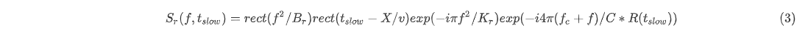

匹配滤波器是发射信号（参考信号）的复共轭：

FFT之后得到的滤波器是什么呢？
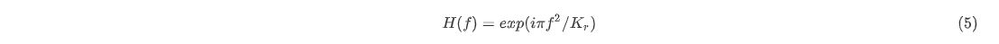
好了，这么一乘，结果不就出来了么？GOOD。当然ifft之后得到的结果是这个样子：
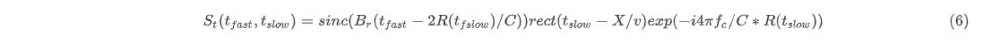

### BP计算

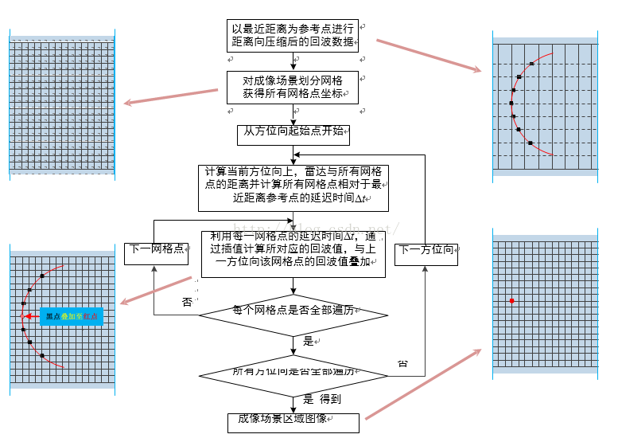

这个图可能很多人都看到过，博主第一次看到的时候也是一脸懵逼啊。接下来我将尝试用我的语言来描述这一过程。

BPA算法的核心是用插值的手段，在时域图像，对每一个网格点进行相位补偿。

#### 计算当前方位向上，雷达与所有网格的距离并计算所有网格点相对于最近距离参考点的延迟时间

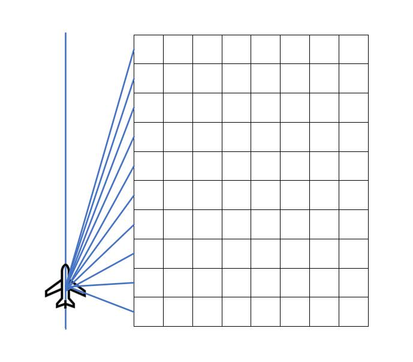

为什么要计算相对于最近距离参考点呢？

因为我们成像得到的图像，不是从飞机开始的图像，而是一片距离图像。就像下图所示一样，我们成像得到的区域是Rnear到Rfar这一段区域，所以就需要考虑所有网格点相对于Rnear的距离。只有这段距离才是有意义可以用来做补偿计算的距离。

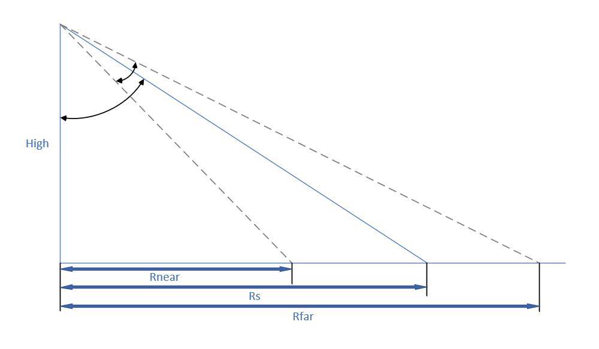

#### 利用每一网格点的延迟时间，通过插值计算所对应的回波值，与上一方位向该网格点的回波值叠加

这一步就是BPA计算的核心之处。

我们先来看一下SAR雷达储存信号的格式：

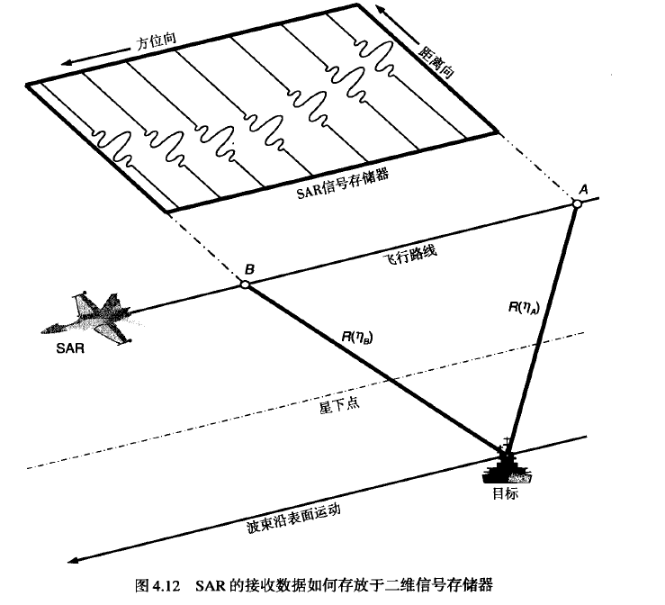

我们可以看出，每一方位向都储存着该时刻距离维信息。但是由于距离徙动现象，所以距离向脉压后，我们得到的成像数据是一个圆弧线。我们现在要做的就是，计算这一时刻下，每一个网格点相对于雷达的距离，然后我们在当前方位时刻下采集到的距离数据中，找到也是距离为处的数据，我们认为这个网格点在这一方位时刻应该收获的就是这个数据。

可能上面一段话比较拗口，我就找张图来解释一下：

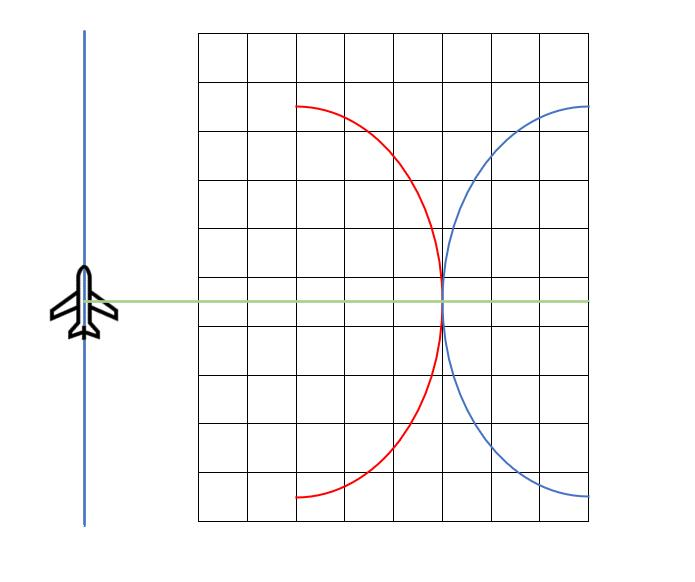

上图中蓝线就代表着一个点有距离徙动后的表现（这里我画的弧度比较夸张）。

上图中红线就是上面那段话所做的事情。本质上就是计算出每一个网格点对应雷达的距离，然后计算这个距离在绿线（当前方位时刻距离数据）上，能在什么位置。找到对应位置的数据，然后把它加到网格点上去，就完成了一个方位点下的计算。剩下的就是不断重复的过程了。

为什么这么计算有效果呢？就是在这种计算方式下，我们可以不断重复这一过程，然后就把每一个成像点对应的距离徙动点都能叠加到该成像点应该在的位置上，而对于其他误叠加点来说，由于只会误判叠加一次，而和不断重复叠加的成像点来说，这是很小的一个数值，所以就可以忽略掉它。

这就是BPASAR成像的全过程啦，学习这个让我懵了好久，也不知道以后会不会继续学习相关知识，这里就先做一个总结。

2020.11.18 天气大好

由于个人原因，很久没有登陆CSDN，也就忘记上传代码了，再次表示抱歉。

现已上传基于LFM和FMCW体制的两份代码供大家参考。

本人以后可能会远离SAR，也可能不会，先将代码上传上来，以示开源精神，也是对自己的一个总结和鞭策吧。

再次感谢关注我的朋友们。

2021.7.8 狂风骤雨，但雨过天晴
